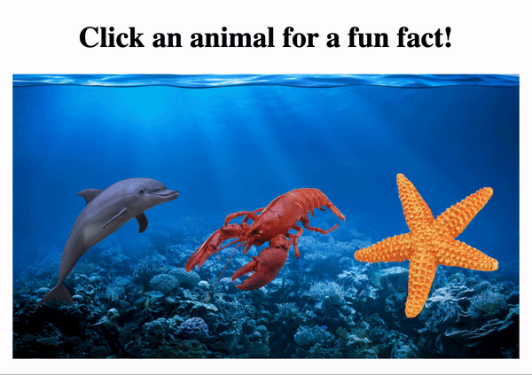

# **Animal Fun Facts**

The Animal Fun Facts app shows a fun fact pop up after clicking an animal. This app is a [Codecademy](https://www.codecademy.com/learn/react-101) project intended to enhance my skills on the use of JSX.

## Table of Contents

- [Project Prompt](#project-prompt)
- [Technologies](#technologies)
- [Setup](#setup)
- [Sources](#sources)

## Project Prompt

In this project, we’ll build a program that allows users to click an animal on the screen in order to have a fun fact pop up.

Our program will display a selection of animals on the screen. We’ll be allowed to decide if we want to include a background or not. Clicking an animal will cause a fact to be randomly selected from a list of potential options. The selected fact will pop up on the screen. As we keep clicking, we’ll be able to see different facts.

## Technologies

- React

## Setup

To view the final output, click [here](https://daniellabrador.me/codecademy-react-animal_fun_facts).

## Sources

The techniques utilized was based on the lessons taught in [Codecademy's Learn React Course](https://www.codecademy.com/learn/react-101). The challenge is also provided by Codecademy.
